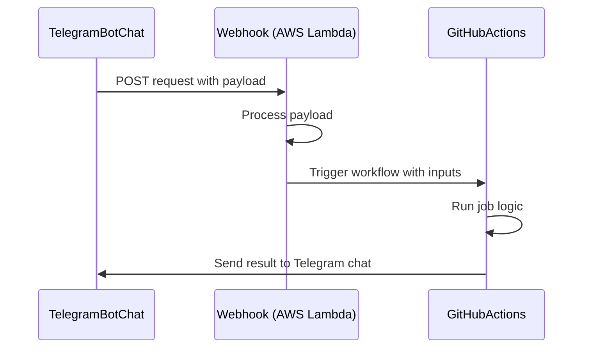

# garcon

[](https://github.com/neostandard/neostandard)

My personal bot to collapse multiple clicks into a single one.


## Actions

Each action is a boring task that I don't want to do.
I automated it with this repository that provides a set of GitHub Actions to run the tasks.

### download-tdg

Download my favorite free magazine from [https://www.terradeigiochi.it/1039-tdg-magazine](https://www.terradeigiochi.it/1039-tdg-magazine)

| Environment variable | Description | Default value |
| --- | --- | --- |
| `TDG_USER` | Username to login to the website | |
| `TDG_PASSWORD` | Password to login to the website | |
| `TDG_ARTIFACT_NAME` | File name of the downloaded file | `tdg.pdf` |
| `TDG_HEADLESS` | Run the browser in headless mode | `true` |
| `TDG_TEST` | Skip the checkout logic to avoid to get a ban | `false` |
| `TELEGRAM_BOT_TOKEN` | Telegram bot token | |
| `TELEGRAM_CHAT_ID` | Chat id where the bot will send the downloaded file | |

Run locally with:

```sh
node --env-file=.env index.js --jsonPath=fixtures/action-megazine.json
```

### remind-me

Extract reminders from forwarded messages using AI to parse media releases and events.

This action uses Google's Gemini AI to intelligently extract reminder information from forwarded Telegram messages, including:
- Media titles (movies, anime, manga, video games)
- Release dates
- Platforms and studios
- Event dates

The AI can understand messages in both Italian and English, and automatically formats the output as structured reminders.

| Environment variable | Description | Default value |
| --- | --- | --- |
| `GOOGLE_AI_API_KEY` | Google AI API key for Gemini | |
| `TELEGRAM_BOT_TOKEN` | Telegram bot token | |
| `TELEGRAM_CHAT_ID` | Chat id where the bot will send the reminders | |
| `DEBUG_REMIND_ME` | Enable debug mode to save AI responses | `false` |

Run locally with:

```sh
node --env-file=.env index.js --jsonPath=fixtures/forward-channel-msg-with-photo.json
```

The action automatically sends formatted reminders back to the Telegram chat so you can copy them
and ask to Gemini to add them to your calendar or reminder app (simple MVP/copy-paste solution).

### inspect-cardtrader

Inspect a Cardtrader wishlist by calling the Cardtrader API and logging the raw response.

| Environment variable | Description | Default value |
| --- | --- | --- |
| `CARDTRADER_API_KEY` | Cardtrader API key used for authenticated requests | |
| `CARDTRADER_WISHLIST_ID` | ID of the wishlist to fetch from Cardtrader | |
| `DEBUG_INSPECT_CARDTRADER` | Enable extra logging for the inspect-cardtrader action | `false` |

```sh
node --env-file=.env index.js --jsonPath=fixtures/cardtrader.json
```

### read-chat-id

Echo the chat id of the message received by the bot.

| Environment variable | Description | Default value |
| --- | --- | --- |
| `TELEGRAM_BOT_TOKEN` | Telegram bot token | |
| `TELEGRAM_CHAT_ID` | Chat id where the bot will send the downloaded file | |

Run locally with:

```sh
node --env-file=.env index.js --jsonPath=<telegram json payload file>
```

## Configuration

The configuration covers the following architecture:



### Telegram

The actions are designed to submit the results to a Telegram chat. To do this, you need to:
1. Create a Telegram bot with BotFather and get the token
2. Get the chat id where the bot will send the messages
3. Set the Webhook to the bot

To get the chat id quickly and locally, you can use the following code:

```sh
# Start the bot
npm run start:read-chatid

# Send a message to the bot in the chat you want to use
# The bot will reply with the chat id in the console and in the chat

# __After__ you complete the `Deployment` section, you must update the telegram bot webhook
npm run deploy:webhook
```


### Deployment

Since every action is a GitHub Action, it must be triggered by an event.
While the trigger can be a cron job, the `/garcon-bot-app` folder source handles the message sent to the Telegram bot as triggers.

This is done by configuring a dummy AWS Lambda function that triggers a GitHub Action when it receives a message from the Telegram bot.

Note that the bot is a personal bot, so it can only be used by a single user, so this solution is not designed to be multi-tenant.

Moreover, the deployment is done manually via AWS SEM as first step, it will be automated if necessary or PRs are welcome indeed.
Read the [README.md](./garcon-bot-app/README.md) for more information.


## License

Copyright [Manuel Spigolon](https://github.com/Eomm), Licensed under [MIT](./LICENSE).
