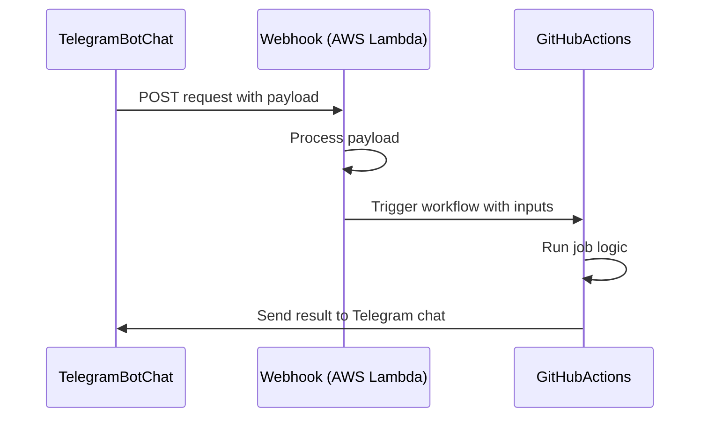

# garcon

[](https://github.com/neostandard/neostandard)

My personal bot to collapse multiple clicks into a single one.


## Actions

Each action is a boring task that I don't want to do.
I automated it with this repository that provides a set of GitHub Actions to run the tasks.

### download-tdg

Download my favorite free magazine from [https://www.terradeigiochi.it/1039-tdg-magazine](https://www.terradeigiochi.it/1039-tdg-magazine)

| Environment variable | Description | Default value |
| --- | --- | --- |
| `TDG_USER` | Username to login to the website | |
| `TDG_PASSWORD` | Password to login to the website | |
| `TDG_ARTIFACT_NAME` | File name of the downloaded file | `tdg.pdf` |
| `TDG_HEADLESS` | Run the browser in headless mode | `true` |
| `TDG_TEST` | Skip the checkout logic to avoid to get a ban | `false` |
| `TELEGRAM_BOT_TOKEN` | Telegram bot token | |
| `TELEGRAM_CHAT_ID` | Chat id where the bot will send the downloaded file | |

Run locally with:

```sh
node --env-file=.env index.js --jsonPath=fixtures/action-megazine.json
```

### remind-me

Extract reminders from forwarded messages using AI to parse media releases and events.

This action uses Google's Gemini AI to intelligently extract reminder information from forwarded Telegram messages, including:
- Media titles (movies, anime, manga, video games)
- Release dates
- Platforms and studios
- Event dates

The AI can understand messages in both Italian and English, and automatically formats the output as structured reminders.

| Environment variable | Description | Default value |
| --- | --- | --- |
| `GOOGLE_AI_API_KEY` | Google AI API key for Gemini | |
| `TELEGRAM_BOT_TOKEN` | Telegram bot token | |
| `TELEGRAM_CHAT_ID` | Chat id where the bot will send the reminders | |
| `DEBUG_REMIND_ME` | Enable debug mode to save AI responses | `false` |

Run locally with:

```sh
node --env-file=.env index.js --jsonPath=fixtures/forward-channel-msg-with-photo.json
```

The action automatically sends formatted reminders back to the Telegram chat so you can copy them
and ask to Gemini to add them to your calendar or reminder app (simple MVP/copy-paste solution).

### inspect-cardtrader

Inspect a Cardtrader wishlist by calling the Cardtrader API and logging the raw response.

| Environment variable | Description | Default value |
| --- | --- | --- |
| `CARDTRADER_API_KEY` | Cardtrader API key used for authenticated requests | |
| `CARDTRADER_WISHLIST_ID` | ID of the wishlist to fetch from Cardtrader | |
| `DEBUG_INSPECT_CARDTRADER` | Enable extra logging for the inspect-cardtrader action | `false` |

```sh
node --env-file=.env index.js --jsonPath=fixtures/cardtrader.json
```

### read-chat-id

Echo the chat id of the message received by the bot.

| Environment variable | Description | Default value |
| --- | --- | --- |
| `TELEGRAM_BOT_TOKEN` | Telegram bot token | |
| `TELEGRAM_CHAT_ID` | Chat id where the bot will send the downloaded file | |

Run locally with:

```sh
node --env-file=.env index.js --jsonPath=<telegram json payload file>
```

### anilist-list-anime

Read a public [AniList](https://anilist.co/) anime list and, optionally, find the new seasons of the
series you follow and add them to your `Planning` list.

| Environment variable | Description | Default value |
| --- | --- | --- |
| `ANILIST_USER` | AniList username to read the anime list of. Overridden by the `--user` argument | |
| `ANILIST_TOKEN` | AniList OAuth access token. Required only to write to the lists. When set, the username is read from the token | |

| Argument | Description | Default value |
| --- | --- | --- |
| `--user` | AniList username | `ANILIST_USER` |
| `--sequels` | Look for new/announced seasons instead of printing the list | `false` |
| `--dry-run` | Only print the new seasons, never touch the `Planning` list | `false` |
| `--yes` | Add every new season without asking | `false` |
| `--depth` | How many times the sequel chain is followed | `10` |

Print the whole anime list, grouped by list (Watching, Planning, Completed, ...).
The `Planning` list is sorted by release date, the unknown ones (`TBA`) first, then the newest:

```sh
npm run start:anilist -- --user=Eomm
```

Find the new seasons and pick the ones to add to `Planning`:

```sh
# Read only: just print what is new
npm run start:anilist-sequels -- --dry-run

# Interactive: asks for each season [y/N/a=all/q=quit] and adds the chosen ones
npm run start:anilist-sequels
```

How the sequel detection works:
- every entry in `Watching`, `Completed`, `Paused` and `Rewatching` is a starting point (`Planning` and
  `Dropped` are skipped on purpose)
- the AniList `SEQUEL` relations of those entries are followed recursively, so a series binge-added years
  ago still reports its latest season (e.g. `Dr. STONE` → `STONE WARS` → `New World` → `SCIENCE FUTURE`)
- a sequel already present in any of your lists is never reported: only the missing ones are
- `NOT_YET_RELEASED` sequels are reported as `announced` (e.g. `[Oshi no Ko] Final Season`), the others
  as `released`
- opening/ending songs (`MUSIC` format) are ignored

Note that the AniList relation graph is franchise-wide: a long chain can drift into spin-offs
(`Fate/Zero` → the whole `Fate` franchise). Lower `--depth` to keep the output tight.

#### AniList authentication

Reading a public list needs no authentication. Adding entries to `Planning` needs an OAuth access token:

1. Create an API client at [https://anilist.co/settings/developer](https://anilist.co/settings/developer)
   using `https://anilist.co/api/v2/oauth/pin` as the redirect URL
2. Open `https://anilist.co/api/v2/oauth/authorize?client_id=<CLIENT_ID>&response_type=token` in the
   browser and authorize the client
3. Copy the `access_token` from the URL fragment into the `ANILIST_TOKEN` env variable

The token is valid for 1 year.
See also [Anilist-Node's guide](https://github.com/AurelicButter/Anilist-Node#using-anilist-node)
for a step by step walkthrough on how to get the token.

## Configuration

The configuration covers the following architecture:


```mermaid
sequenceDiagram
    participant TelegramBotChat
    participant Webhook (AWS Lambda)
    participant GitHubActions

    TelegramBotChat->>Webhook (AWS Lambda): POST request with payload
    Webhook (AWS Lambda)->>Webhook (AWS Lambda): Process payload
    Webhook (AWS Lambda)->>GitHubActions: Trigger workflow with inputs
    GitHubActions->>GitHubActions: Run job logic
    GitHubActions->>TelegramBotChat: Send result to Telegram chat
```

### Telegram

The actions are designed to submit the results to a Telegram chat. To do this, you need to:
1. Create a Telegram bot with BotFather and get the token
2. Get the chat id where the bot will send the messages
3. Set the Webhook to the bot

To get the chat id quickly and locally, you can use the following code:

```sh
# Start the bot
npm run start:read-chatid

# Send a message to the bot in the chat you want to use
# The bot will reply with the chat id in the console and in the chat

# __After__ you complete the `Deployment` section, you must update the telegram bot webhook
npm run deploy:webhook
```


### Deployment

Since every action is a GitHub Action, it must be triggered by an event.
While the trigger can be a cron job, the `/garcon-bot-app` folder source handles the message sent to the Telegram bot as triggers.

This is done by configuring a dummy AWS Lambda function that triggers a GitHub Action when it receives a message from the Telegram bot.

Note that the bot is a personal bot, so it can only be used by a single user, so this solution is not designed to be multi-tenant.

Moreover, the deployment is done manually via AWS SEM as first step, it will be automated if necessary or PRs are welcome indeed.
Read the [README.md](./garcon-bot-app/README.md) for more information.


## License

Copyright [Manuel Spigolon](https://github.com/Eomm), Licensed under [MIT](./LICENSE).
